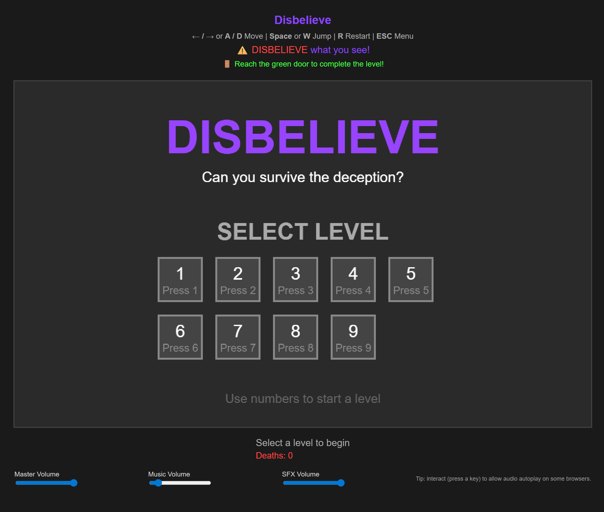
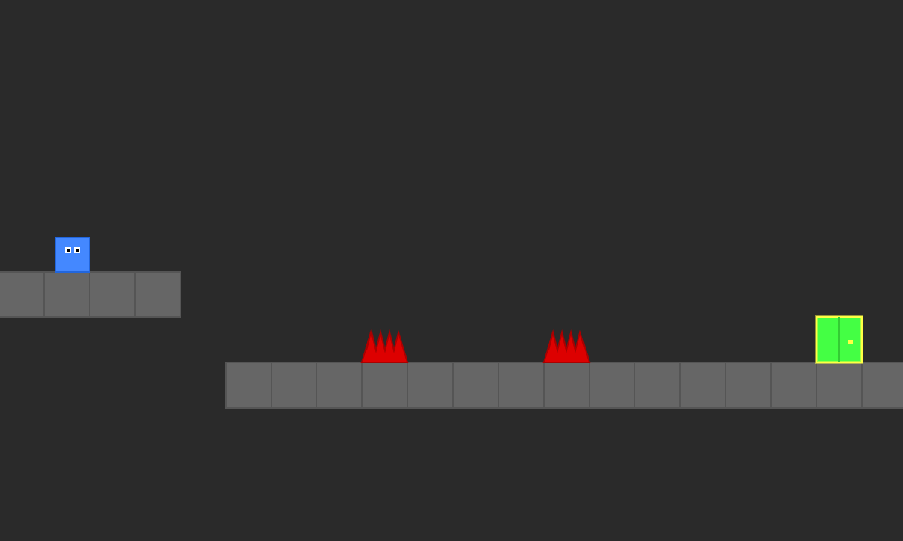
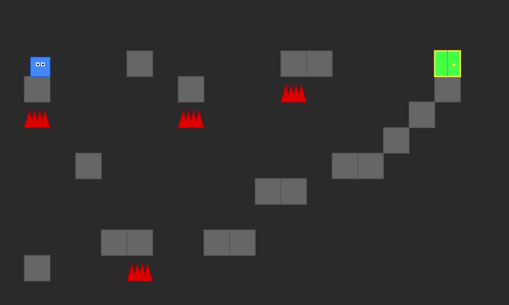

# DISBELIEVE - A Deceptive 2D Platformer (Prototype)

> **🚧 Prototype Version**: This is the initial prototype of DISBELIEVE, demonstrating core gameplay mechanics and level design concepts. Expect further development and improvements in future versions!

Welcome to DISBELIEVE, a mind-bending 2D platformer where nothing is as it seems! Can you navigate through increasingly deceptive levels filled with traps, fake platforms, and moving spikes?

*(You can add your title screen screenshot here)*

## 🎮 Play the Game

1. Clone this repository
2. Open `play.html` in your web browser
3. Trust nothing, question everything!

## 📸 Screenshots

Here's what awaits you in DISBELIEVE:

## 🎯 How to Play

- **Move:** ← / → arrows or A / D keys
- **Jump:** Space or W key
- **Restart Level:** R key
- **Return to Menu:** ESC key

## 🏆 Features

- Increasingly challenging levels
- Deceptive traps and moving spikes
- Fake platforms that look solid but aren't
- Death counter to track your attempts
- Atmospheric sound effects and music
- Instant respawn system

## 💀 Warning

Things are not always what they seem. Trust your instincts, but be prepared to...
# DISBELIEVE

## 🔧 Technical Details

- Pure JavaScript and HTML5 Canvas
- No external libraries required
- Responsive design
- Custom physics engine
- Prototype-focused clean codebase

## 🎯 Prototype Scope

This prototype version includes:
- Core gameplay mechanics
- Basic level design system
- Essential trap mechanics
- Simple but effective visual style
- Basic sound system
- Death counter and level progression

## 📝 Development Notes

For developers interested in the technical aspects:
- All game logic is contained in `src/game.js`
- The main entry point is `play.html`
